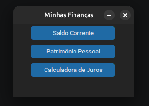
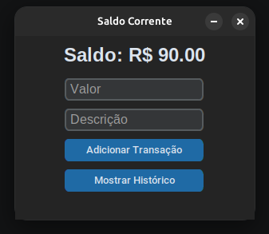
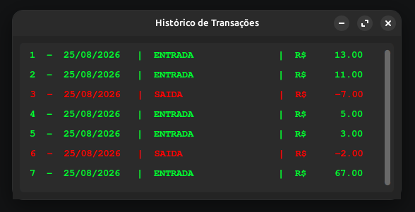
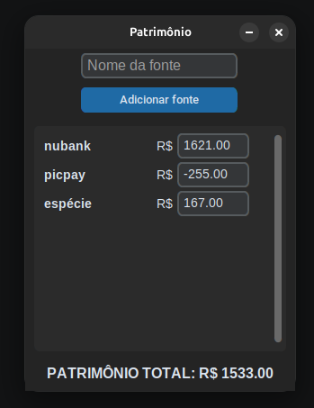
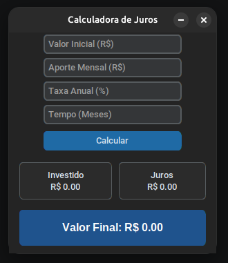
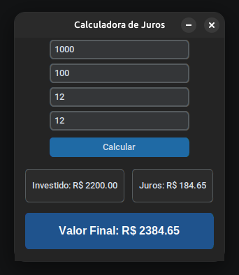

# My Finance

O **My Finance** é um sistema de controle financeiro pessoal *open source*, desenvolvido para ser executado localmente no seu computador. 

Seu objetivo é oferecer uma interface simples, rápida e 100% privada para o registro de transações diárias, acompanhamento de patrimônio e simulações financeiras.

---

## Tecnologias

* **Python 3**: Linguagem base do projeto.
* **CustomTkinter**: Interface gráfica moderna.
* **SQLite**: Banco de dados local e leve.

---

## Screenshots

### Aba principal do APP



### Saldo Corrente e histórico de transações
 

### Acompanhamento de patrimônio


### Simulações financeiras
 

---

## Instalação e Compilação

### Download do Executável
Você pode baixar a versão pronta para uso diretamente na aba de **Releases** ou através dos **Artefatos do GitHub Actions**.

### Compilação Local
Se preferir gerar o executável (.exe ou binário) localmente na sua máquina, execute no terminal:

```bash
pip install pyinstaller
pip install -r requirements.txt

pyinstaller --noconsole --onefile my-finance.py